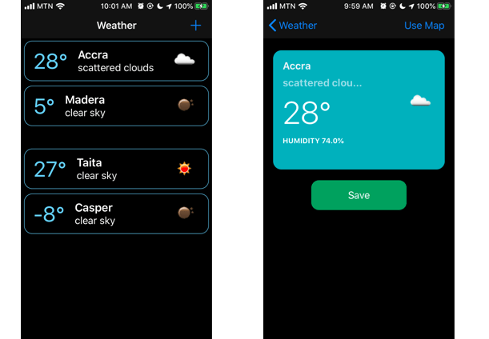

# Weather Logger
Weather Logger saves a users weather condition using their current location or a map. Users can view, save and delete weather conditions.

## Starting the App
* The app starts with an alert letting the user know they can use the add button to start logging locations.
* When the add button is pressed, a request user location permission is presented to choose from.
* The options available are Allow While Using App, Allow Once, Don't Allow.
* When "Allow While Using App" option is selected, the app pulls the users current location.
* When "Allow Once" option is selected, the app pulls the users current location but does that for the current app session and doesn't persist the location when the app is restarted.
* When "Don't Allow" option is selected, the app allows you to use the map. 

## Adding Weather Conditions
* Weather conditions are added by pressing on the add button in the top right section of the application.
* If location permission has been granted, app connects to an API and brings weather condition for your current location.
* If location permission has been denied, app shows you a map which you can Long press to drop a pin on any location.

## Saving 
* location data can easily be saved by pressing the save button.
* saving is done by using core data. 
* When save is successful, a user is navigated to the home page where the save weather is added to a collection view.
* The collection view uses the new diffable data source which makes adding very smooth and performant. 

## Deleting
* Pressing on any weather in the collection view opens up the weather in a detail view. 
* Pressing the delete button on the detail view, deletes a weather condition with confirmation.

### Future Improvements
* Improve Code Readability by using an Architecture like MVVM.
* Improve Code Readability by using the SOLID principle and dependency Injection via initialisation.
* Leverage off generics and call backs to add modularity to codebase. 
* Add functionality to pull photos and forecast data for a saved location.
* Add a library like Alomofire and Kingfisher to manage caching and network calls.

### Requirements
- Xcode 11 and Above
- iOS 13

